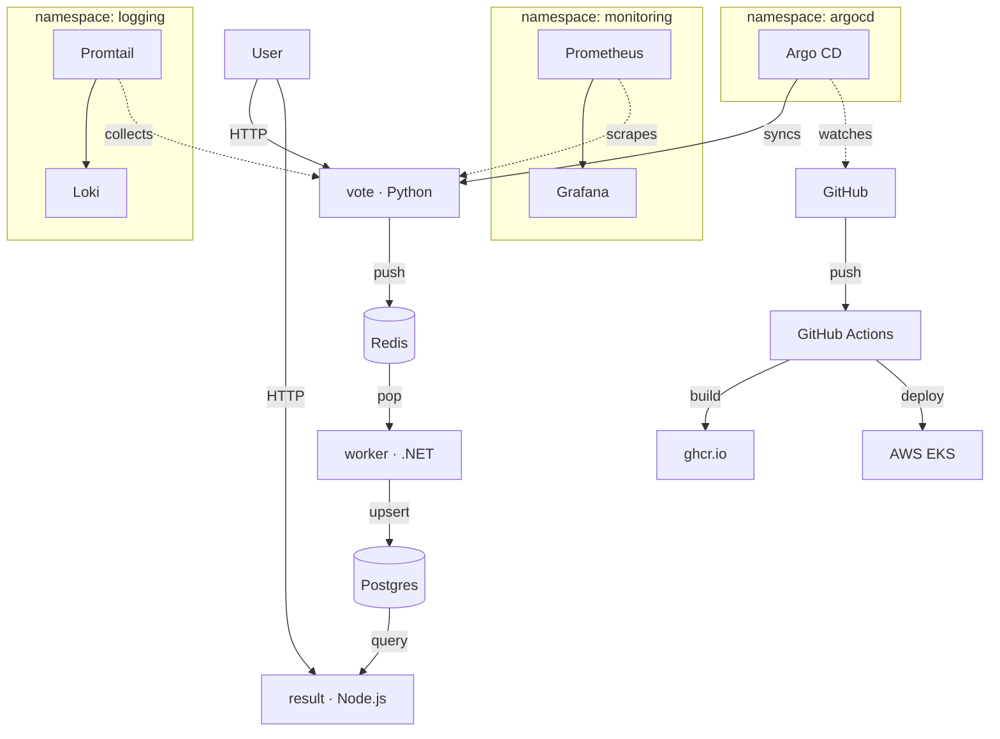
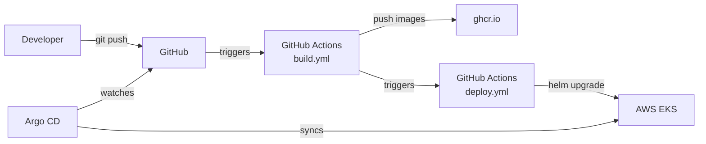
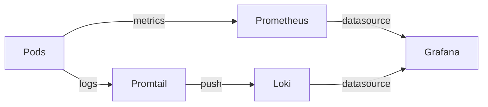

# K8s Voting App

    A microservices voting application deployed on Kubernetes, demonstrating real-world DevOps practices: GitOps, observability, infrastructure as code, and CI/CD.

## Architecture



## Stack

| Layer | Technology |
|---|---|
| Application | Python, Node.js, .NET |
| Containerization | Docker, docker-compose |
| Local cluster | kind |
| Package manager | Helm |
| GitOps | Argo CD |
| Monitoring | Prometheus, Grafana |
| Logging | Loki, Promtail |
| Cloud | AWS EKS |
| Infrastructure | Terraform |
| CI/CD | GitHub Actions |

## Project Structure

```
k8s-voting-portfolio/
├── app/                        # microservices source code
│   ├── vote/
│   ├── result/
│   └── worker/
├── docker/
│   ├── docker-compose.yml      # local development
│   └── kind-config.yaml        # kind cluster config
├── k8s/                        # raw kubernetes manifests
├── helm/voting-app/            # helm chart
│   ├── values.yaml             # shared defaults
│   ├── values-local.yaml       # kind overrides
│   └── values-eks.yaml         # EKS overrides
├── argocd/
│   ├── app-of-apps.yaml        # root argocd application
│   ├── install/
│   │   └── argocd-values.yaml
│   └── apps/
│       ├── voting-app.yaml     # kind deployment
│       ├── voting-app-eks.yaml # EKS deployment
│       ├── monitoring.yaml
│       └── logging.yaml
├── monitoring/
│   ├── prometheus-values.yaml
│   └── dashboards/
├── logging/
│   └── loki-values.yaml
├── terraform/                  # AWS EKS infrastructure
│   ├── main.tf
│   ├── variables.tf
│   ├── outputs.tf
│   └── modules/
│       ├── vpc/
│       └── eks/
└── .github/workflows/
    ├── build.yml               # build and push images
    └── deploy.yml              # deploy to EKS
```

## Prerequisites

```bash
docker
kind
kubectl
helm
terraform
aws cli
```

## Quick Start — Local (kind)

```bash
# Clone the repo
git clone https://github.com/YOUR_USERNAME/k8s-voting-app.git
cd k8s-voting-app

# Full local setup — one command
make up
```

This will:
1. Build Docker images locally
2. Create a kind cluster (1 control-plane + 2 workers)
3. Load images into kind
4. Install Argo CD
5. Deploy the app via Argo CD

```bash
# Vote UI
http://localhost:5000

# Results UI
http://localhost:5001

# Argo CD UI
make argocd-port-forward  # → localhost:8080
make argocd-password

# Grafana
make monitoring-grafana   # → localhost:3000
# login: admin / admin
```

## Deploy to AWS EKS

### 1. Provision infrastructure

```bash
# Configure AWS credentials
aws configure

# Edit backend config in terraform/main.tf
# Replace YOUR-terraform-state and YOUR-terraform-locks

cd terraform
terraform init
terraform apply
```

This creates:
- VPC with public and private subnets across 3 AZs
- Single NAT Gateway (cost optimised)
- EKS cluster (t3.medium nodes, autoscaling 1-4)
- EBS CSI Driver addon

### 2. Deploy the application

```bash
# Configure kubectl for EKS
make eks-kubeconfig

# Install Argo CD and deploy with EKS values
make eks-argocd-install
```

Argo CD will deploy:
- voting app using `values-eks.yaml` (ghcr.io images, ALB ingress, gp2 storage)
- Prometheus + Grafana in `monitoring` namespace
- Loki + Promtail in `logging` namespace

### 3. Destroy

```bash
make eks-destroy
```

## GitOps Flow



## CI/CD

**build.yml** — triggered on push to `main` when app code changes:
- Builds Docker images for all 3 services in parallel
- Pushes to GitHub Container Registry with two tags: `latest` and short SHA
- Creates a GitHub Release with image references

**deploy.yml** — triggered after successful build:
- Authenticates to AWS via OIDC (no long-lived credentials)
- Runs `helm upgrade` against EKS cluster
- Verifies all deployments rolled out successfully

## Observability



**Grafana dashboards:**
- Kubernetes cluster overview (auto-provisioned by kube-prometheus-stack)
- Per-namespace resource usage
- Voting App custom dashboard

**Loki log queries:**
```
{namespace="voting"}
{namespace="voting", app="vote"}
{namespace="voting"} |= "error"
```

## Makefile Reference

```bash
make up                   # full local setup
make docker-up            # run via docker-compose only
make kind-create          # create kind cluster
make kind-delete          # delete kind cluster
make argocd-install       # install Argo CD
make argocd-apply-local   # apply kind Argo CD apps
make argocd-apply-eks     # apply EKS Argo CD apps
make argocd-password      # get Argo CD admin password
make argocd-port-forward  # open Argo CD UI
make monitoring-grafana   # open Grafana
make grafana-password     # get Grafana password
make eks-create           # provision EKS via Terraform
make eks-destroy          # destroy EKS cluster
make eks-kubeconfig       # configure kubectl for EKS
make eks-argocd-install   # install Argo CD on EKS
make port-forward-vote    # open vote app
make port-forward-result  # open result app
make clean                # delete everything local
```

## Namespaces

| Namespace | Contents |
|---|---|
| `voting` | vote, result, worker, redis, postgres |
| `argocd` | Argo CD |
| `monitoring` | Prometheus, Grafana |
| `logging` | Loki, Promtail |